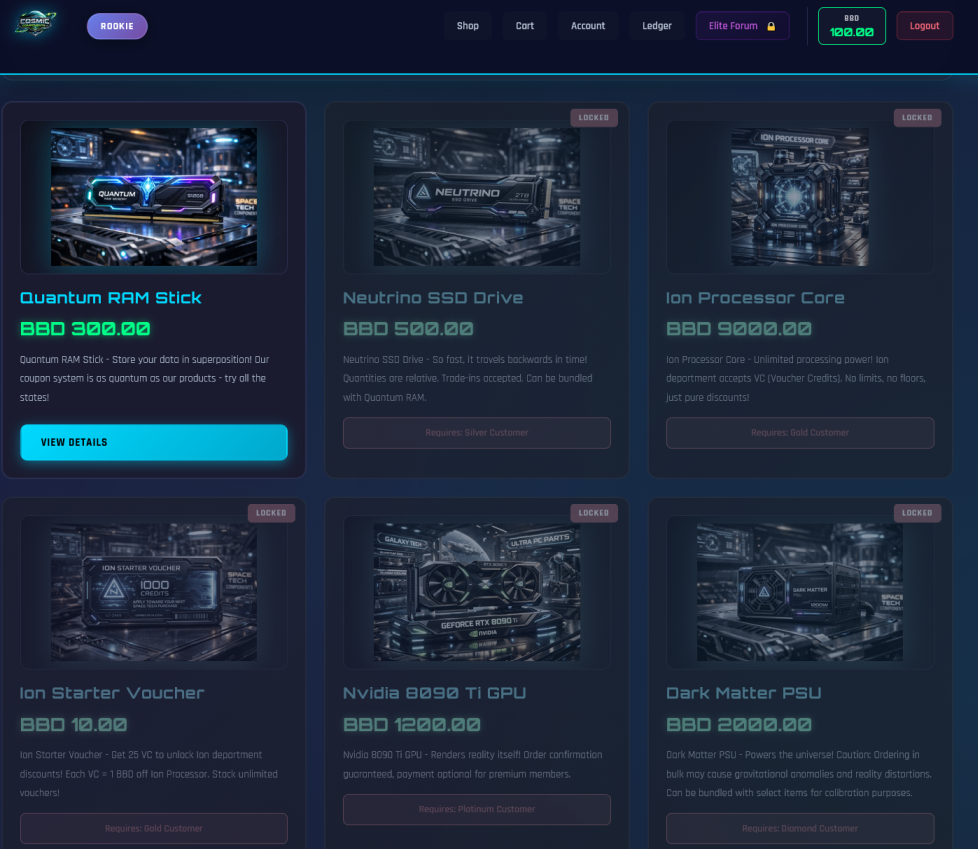
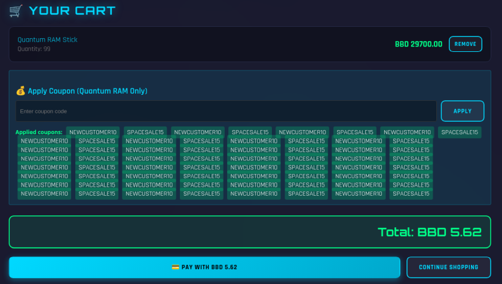
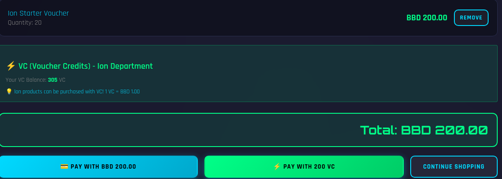
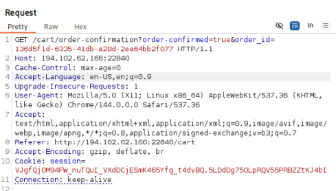
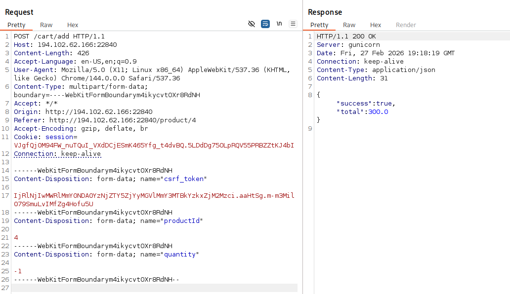
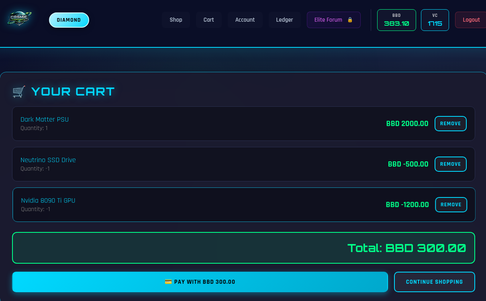
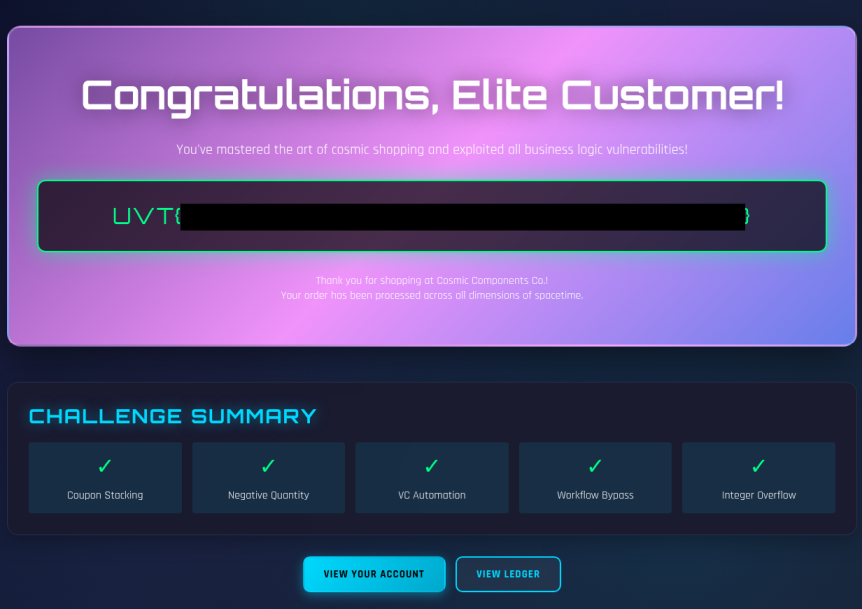

## CTF Write-Up: Nightmare Customer
- Challenge Overview
  - **Name:** Nightmare Customer
  - **Category:** Web
  - **Points earned:** 59 (The points start at 500 for each challenge and go down for each team that solves a specific challenge. At that time, 12 hours into the event, 71 out of 566 teams had solved it, including us.)
  - **Description:** You stumble upon the infamous online tech shop called "Cosmic Components Co." Their entire business model seems designed to rip off individual customers while raking in billions and billions of dollars from deals with AI Data Centers.  
  Exploit their website and buy all the products to show them that the regular costumer shouldn't be neglected!
  - **Provided URL:** `http://194.102.62.166:22840`
  - **Flag Format:** `UVT{...}`
- Goal: The objective is to purchase all six products in the Cosmic Components Co. shop, advancing through every customer tier (Rookie → Silver → Gold → Platinum → Diamond → Elite) to ultimately access the Elite Forum at `/flag` and capture the flag. Each product requires a higher tier, and the player starts with only 100 BBD (billions and billions of Dollars) — far less than the cost of most items. The challenge requires discovering and chaining multiple business logic vulnerabilities to afford every purchase. 
- Initial Analysis: 
After registering an account and logging in, the application presents a space-themed e-commerce shop built with Flask and Jinja2. The shop page lists six products, each locked behind a customer tier:


At the beginning, the customer rank was rookie and only the "Quantum RAM Stick" was purchasable. The starting wallet balance is only 100 BBD, and tiers advance by purchasing unique products, not by spending more on the same item.

### Reconnaissance

**Tools used:** Chromium browser, Burp Suite (proxy + repeater)

Several interesting clues were found in the HTML source comments:  

```
<!-- FIXME: Disable template debugging in production - app/config/request objects leak in error messages -->
<!-- DEV NOTES: Admin panel accessible at /admin/dashboard (requires admin role in JWT) -->
<!-- GraphQL endpoint: /graphql - Schema introspection enabled for debugging -->
<!-- Legacy API (deprecated): /api/v1/users/{id}/wallet - PATCH method for balance adjustments -->
```

These were however all dead-ends. None of the endpoints were reachable.   

Another dead-end was as seeming SSTI vulnerability in the account bio:  
I tried `{{7*7}}`, which then displayed as `49` in the bio. `{{ session  }}` displayed: `{'user_id': 'ed18b99d-f10d-4983-8990-11ab7f296a11', 'tier': 'Free', 'csrf_token': '***REDACTED***'}`. I tried out various inputs to try and get more information but nothing came of it. This cost me the most time.  

After this I simply tried out various parts of the shop, to try and find something. See how it works and find some other endpoints. Nothing of it was particularly fruitful. No interesting endpoints and it simply uses session cookies, no JWT, despite what is says in the html and forging wasn't going to work.  
There were two vouchers, which make the products cheaper and I tried to apply them multiple times, while the two did stack, when I tried to apply the same one twice, it wouldn't let me.

Additionally, each product description contained hints about its exploit vector, I had ignored them though initially:

- **Quantum RAM:** *"Our coupon system is as quantum as our products — try all the states!"*
- **Neutrino SSD:** *"Quantities are relative. Can be bundled with Quantum RAM."*
- **Ion Processor:** *"No limits, no floors, just pure discounts!"*
- **Nvidia GPU:** *"Order confirmation guaranteed, payment optional for premium members."*
- **Dark Matter PSU:** *"Ordering in bulk may cause gravitational anomalies. Can be bundled with select items."*

## Solution Path
### Step 1: Coupon Stacking — Buying the Quantum RAM Stick (Rookie → Silver)
The breakthrough happened when instead of applying one of the two coupons twice in a row, I applied the several times alternatingly `NEWCUSTOMER10` (10% off) and `SPACESALE15` (15% off), which did work. I did this many times, until the price was very low and I was able to buy the RAM sticks.

After purchasing, the tier advanced from **Rookie to Silver**. Buying more RAM does nothing anymore to help advance further at this point.

### Step 2: Bundling — Buying the Neutrino SSD (Silver → Gold)
Next is the SSD (BBD 500), which did not accept coupons. However, its description says that it *"can be bundled with Quantum RAM."* By adding both the SSD and RAM sticks to the same cart, the alternating coupon trick works as well, making the SSD affordable. Tier advanced from **Silver to Gold**.

### Step 3: Voucher Credit Multiplication — Buying the Ion Processor (Gold → Platinum)
At Gold tier, two new products unlocked: the Ion Processor Core (BBD 9000) and the Ion Starter Voucher (BBD 10). Each voucher granted 25 VC (Voucher Credits), and VC could be used as payment — with 1 VC = 1 BBD for Ion Processor.  
The exploit here is:  I can buy a VC voucher with the BBD currency, then redeem it and get 25 VC. They cost 10 BBD or 10 VC because 1 VC = 1 BBD, so I can keep buying the vouchers and increase my VC, I gain 15 VC per voucher.


I had to redeem each voucher by hand and the Processor cost a lot, 9000 vs and I only gained 15 per voucher, so it took a lot of time. I somewhat automated this process by using a python script. I still bought the vouchers by hand but it automatically redeemed them for me.
```python
#!/usr/bin/env python3
import requests
import re

URL = "http://194.102.62.166:22840"
SESSION = "VJgfQj0M94FW_nuTQuI_VXdDCjESmK465Yfg_t4dvBQ.5LDdDg75OLpRQV55PRBZZtKJ4bI"

s = requests.Session()
s.cookies.set("session", SESSION)

def get_csrf():
    page = s.get(f"{URL}/account")
    return re.search(r'name="csrf-token" content="([^"]+)"', page.text).group(1)

def get_pending_vouchers():
    page = s.get(f"{URL}/account")
    codes = re.findall(r'(ION-[A-F0-9]{8}).*?PENDING', page.text, re.DOTALL)
    return codes

pending = get_pending_vouchers()
print(f"Found {len(pending)} pending vouchers")

for i, code in enumerate(pending):
    csrf = get_csrf()
    r = s.post(f"{URL}/redeem-voucher", data={
        "csrf_token": csrf,
        "voucher_code": code
    })
    data = r.json()
    print(f"[{i+1}/{len(pending)}] Redeemed {code} -> VC: {data.get('vc_balance', '?')}")

print("Done!")
```

With this I quickly got enough VC to purchase the processor and advancing from **Gold to Platinum**.

### Step 4: Premium Payment Bypass — Buying the Nvidia GPU (Platinum → Diamond)
Next on the *"to buy list"* is the GPU, which cost 1200 BBD but neither a combination with RAM nor vouchers could be used. The product description stated *"payment optional for premium members."* To buy the it, I had to send a GET request with the parameter `order-confirmation?order-confirmed=true`. So I just took one of the previous GET requests and resend it, while having the GPU in the cart. All orders have IDs but that seemed to be irrelevant here.

This bypassed the payment validation completely, confirming the order without having to pay anything and advancing from **Platinum to Diamond**.

### Step 5: Negative Quantity Bundling — Buying the Dark Matter PSU (Diamond → Elite)
The last item was the *"PSU"*, which cost 2000 BBD. The description hinted at bundling: *"Can be bundled with select items for calibration purposes."* While the UI did not allow adding negative quantities, **Burp Suite** could bypass this, to add items with negative quantities. So I added the *"GPU"* and *"SSD"* with a negative quantity, making the total price **300 BBD**, which I was able to afford thanks to having gotten 100 BBD each time my rank advanced.



With this, my rank advanced to **Elite** and I was able to click on the *"Elite Forum"* button, which accessed the `/flag` endpoint and displayed the flag for me.


## Conclusion
### Vulnerabilities Exploited
This challenge chained the five distinct business logic vulnerabilities that can be seen in the flag image:
1. **Coupon stacking**
2. **Cart bundling to bypass per-product restrictions**
3. **Voucher credit multiplication**
4. **Payment method bypass**
5. **Negative quantity**

### Key Takeaways
 - **Always read product descriptions and HTML comments carefully**
 - **Client-side validation is not security**
 - **All exploits abused flawed application logic.**

### Tips
Do try to automate some of the processes, since doing them manually can take considerable amount of time.
