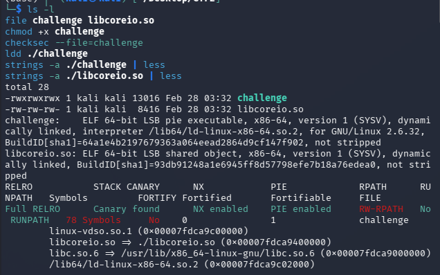
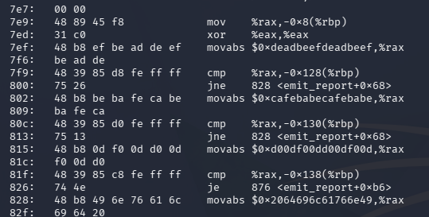
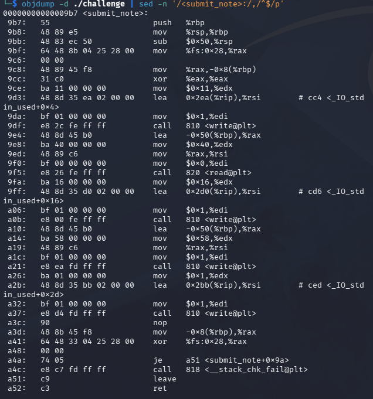
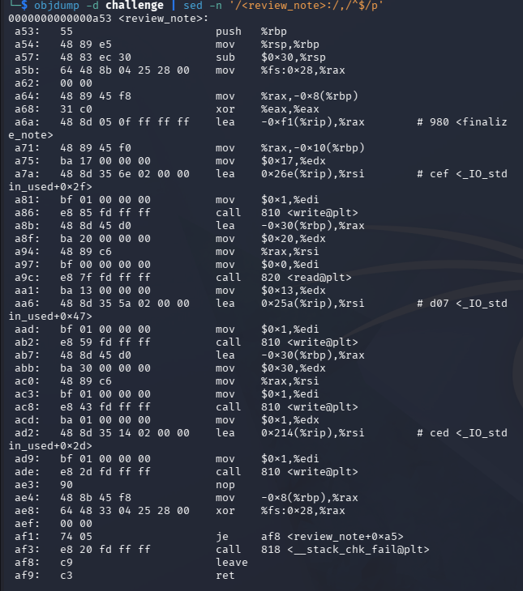
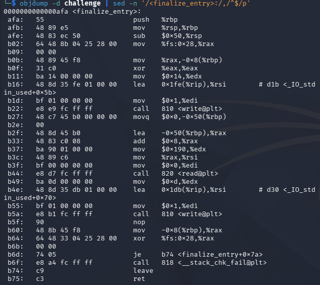
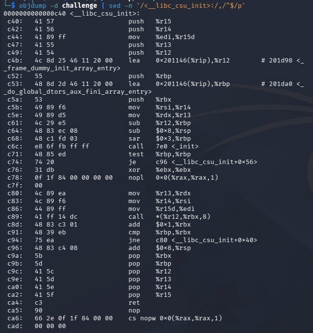
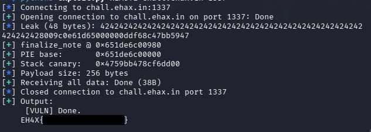

## Challenge Overview

- **Challenge Name:** Womp Womp
- **Category:** Binary Exploitation
- **Difficulty:** Medium
- **Description:** Hippity hoppity the flag is not your property
- **Flag format:** `EHAX{...}`
- **Provided Files / URL:**
  - `challenge`
  - `libcoreio.so`
  - Remote service: `nc chall.ehax.in 1337`

## Goal
Exploit the remote service and obtain the flag in the format `EHAX{...}`.

## Initial Analysis
I first tested both the remote service and the local binary to understand the interaction flow. The program asks for three inputs:

1. `Input log entry:`
2. `Input processing note:`
3. `Send final payload:`


After the first two inputs, the program printed binary-looking garbage bytes after echoing my input. That told me it might be an out-of-bounds read / stack leak.

### Reconnaissance commands
```bash
file challenge libcoreio.so
checksec --file=challenge
ldd ./challenge
nm -D ./challenge
nm -D ./libcoreio.so
```


### Key findings
- `challenge` is a 64-bit PIE executable
- Protections enabled: **Full RELRO**, **Canary**, **NX**, **PIE**
- `challenge` imports `emit_report` from `libcoreio.so`
- Because canary + PIE are enabled, a working exploit likely requires:
  - an information leak (canary + PIE base)
  - a controlled overflow
  - a ROP chain

## Solution Path
### 1) Use the flag routine in `libcoreio.so`
Disassembling `emit_report` revealed the condition to getting the flag. The function checks three 64-bit arguments and only proceeds if they match *"magic"* constants.

Required arguments:

```text
ARG1 = 0xdeadbeefdeadbeef
ARG2 = 0xcafebabecafebabe
ARG3 = 0xd00df00dd00df00d
```


If the values are correct, `emit_report` opens and prints the flag file.
This means the final exploit goal is to call:
```c
emit_report(ARG1, ARG2, ARG3);
```
### 2) Analyze the vulnerable functions in `challenge`
I disassembled `submit_note`, `review_note`, and `finalize_entry`.

#### `submit_note()` - stack leak
Basically it:
- reads `0x40` bytes into a stack buffer at `rbp-0x50`
- writes back `0x58` bytes from that same buffer  

This leaks beyond the user-controlled data into adjacent stack memory (including stack metadata).


#### `review_note()` - PIE leak + canary leak
This one:
- reads `0x20` bytes into a stack buffer at `rbp-0x30`
- stores a function pointer (`finalize_note`) at `[rbp-0x10]`
- writes `0x30` bytes from the buffer region

Which then leaks:
- user-controlled `B...` bytes
- the stored function pointer (`finalize_note`) -> **PIE leak**
- the stack canary -> **canary leak**



#### `finalize_entry()` - stack overflow
Last but not least, it:
- stack frame size: `0x50`
- reads `0x190` bytes into `rbp-0x48`

This overflows the canary, saved RBP, and saved RIP.

Payload layout from the `read()` destination (`rbp-0x48`):

```text
offset 0x00: filler (0x40 bytes)
offset 0x40: stack canary (8 bytes)
offset 0x48: saved RBP (8 bytes)
offset 0x50: saved RIP (ROP chain begins here)
```


### 3) Gadget constraints and ret2csu strategy
I found these useful gadgets in `challenge`:

- `pop rdi ; ret`
- `pop rsi ; pop r15 ; ret`
- no direct `pop rdx ; ret`

Since `emit_report()` requires `rdi`, `rsi`, and `rdx`, the missing `pop rdx ; ret` makes a standard direct ROP call not doable.

The workaround is to use the `__libc_csu_init` gadgets (ret2csu) to set `rdx` via `r13`.


Also, the csu call gadget sets `edi` with `r15d` (32-bit), so it can't directly set `rdi = 0xdeadbeefdeadbeef` (full 64-bit). This means we need to:

1. use ret2csu only to set `rdx = ARG3`
2. then use normal gadgets to set:
   - `rdi = ARG1`
   - `rsi = ARG2`
3. call `emit_report@plt`

### 4) Preserving `rdx` with `.init_array` / `frame_dummy`
The ret2csu sequence needs a function call (`call [r12 + rbx*8]`). I used `.init_array` as the function pointer table and called the first entry (`frame_dummy`) by setting:

- `rbx = 0`
- `r12 = pie_base + INIT_ARRAY_OFF`

This call path keeps the `rdx` value set via `r13`, which makes it possible for the chain to continue with `rdx = ARG3` still there.

### 5) Building the final ROP chain
Final chain structure inside the `finalize_entry()` overflow:

1. Overflow to RIP while restoring the correct canary
2. ret2csu setup + csu call to set `rdx = ARG3`
3. padding
4. `pop rdi ; ret` -> `ARG1`
5. `pop rsi ; pop r15 ; ret` -> `ARG2`
6. `ret` for correct alignment
7. `emit_report@plt`

## Commands, Scripts, and Code Snippets
### Useful analysis commands
```bash
objdump -d -Mintel ./challenge | sed -n '/<submit_note>:/,/^$/p'
objdump -d -Mintel ./challenge | sed -n '/<review_note>:/,/^$/p'
objdump -d -Mintel ./challenge | sed -n '/<finalize_entry>:/,/^$/p'
objdump -d -Mintel ./libcoreio.so | sed -n '/<emit_report>:/,/^$/p'
ROPgadget --binary ./challenge | grep -E 'pop rdi ; ret|pop rsi ; pop r15 ; ret|ret$'
```


## Dead Ends / Mistakes (What I Learned)

I initially tried a more complicated two-stage exploit:

- leak `emit_report` runtime address from the GOT
- pivot the stack
- jump into `emit_report` *after* the argument checks

Although this was probably possible, it didn't work well. I'm guessing because it was fragile and just unnecessary. The cleaner solution was:

- use ret2csu only for `rdx`
- use standard gadgets for `rdi` and `rsi`
- call `emit_report@plt` directly

## Flag Capture


## Conclusion
The workflow of this challenge need to overcome several security aspects:

- leak stack data to recover **canary** and **PIE base**
- exploit a stack overflow while preserving the canary
- build a **ROP chain** under gadget constraints
- use **ret2csu** as a practical workaround for missing register-control gadgets (`rdx`)

Main takeaway: when a direct `pop rdx ; ret` gadget is missing, `__libc_csu_init` can often be helpful. It is also very helpful to make a python script to automate the whole exploit, instead of having to retype and retry things in the shell.
